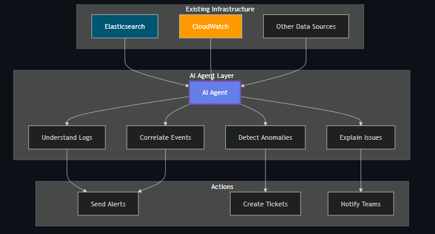
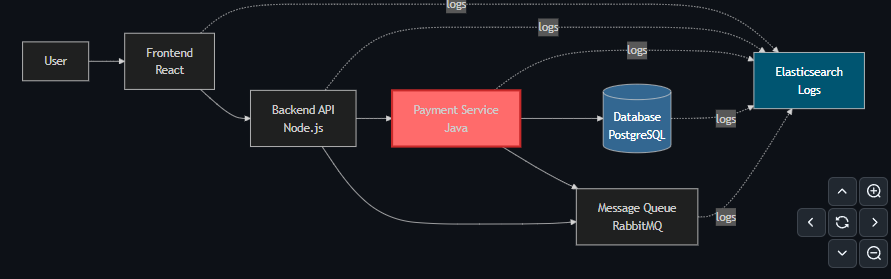
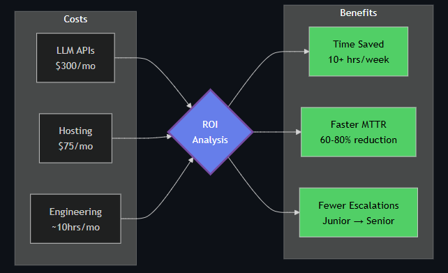

# 01 Introduction

### What is an AI Agent?

In the world of DevOps, an AI agent **for logging** reads your log files, understands what's happening in your systems, and helps you find and fix problems faster.

Think of it like having a smart assistant who **watches your application logs 24/7**. When something goes wrong, it can connect the dots across different services and tell you what's really happening.

Here's what makes an AI agent different from regular scripts:

* It understanding the **meaning** behind error messages
* It learns what "normal" looks like in your system
* It can explain its findings in plain language
* It **remembers past problems** and uses that knowledge to solve new ones

### The Problem with Traditional Tools

The answer is simple. Traditional tools show you data, but they don't understand it.

#### What You Still Have to Do Manually

When something breaks in production, here's what typically happens:

1. You get an alert that something is wrong
2. You open your logging tool
3. You search through logs trying to figure out what happened
4. You check different services one by one
5. You try to connect events across multiple systems
6. Eventually, after 30 minutes to a few hours, you find the root cause

The problem isn't the tool—it's that you need to know what to look for. You need to:

* Write the right search queries
* Know which services to check
* Understand how different errors relate to each other
* Remember similar problems from the past
* Manually connect events across your microservices
  
This takes time and experience. A junior engineer might struggle for hours on something a senior engineer would spot in minutes.

### How AI Agents Help

An AI agent sits on top of your existing logging infrastructure. You're not replacing your logging system—you're adding intelligence to it.



#### What AI Does Better

Here are the specific ways AI improves log analysis:

**Understanding Natural Language**

Developers write log messages in plain English. "Connection timeout after 30 seconds" and "Failed to connect within timeout period" mean the same thing, but traditional tools treat them as different strings.

An AI agent understands both messages mean the same problem. It groups related errors together automatically, even when they're worded differently.

**Connecting Events Across Services**

Modern applications have many moving parts. A single user request might touch 10 different services. When something fails, the root cause might be three services away from where you see the error.

Traditional tools can search across all your logs, but you have to manually figure out which events are related. An AI agent does this automatically. It tracks how your services talk to each other and connects related problems.

**Finding Unknown Problems**

With traditional tools, you can only alert on problems you know about. You write a rule: "Alert me if error rate goes above 5%." But what about problems you haven't seen before?

An AI agent learns what normal behavior looks like for your system. When something unusual happens—even if you never wrote a rule for it—the agent notices and tells you.

**Remembering Past Incidents**

When you solve a problem, that knowledge usually lives in a postmortem document or someone's memory. If the same problem happens again months later, you might not remember the solution.

An AI agent remembers past incidents. When it sees similar patterns, it can tell you: "This looks like the database connection issue from March that was caused by a configuration change."


### A real-world example

> You run an online store. The customers are reporting that checkout is slow. You have logs flowing into Elasticsearch from:

* Frontend (React app)
* Backend API (Node.js)
* Payment service (Java)
* Database (PostgreSQL)
* Message queue (RabbitMQ)



#### Without AI: Manual Investigation

You wake up to the alert and open Kibana.

First, you search for "checkout" errors. No obvious errors—everything returns 200 OK.

You check your dashboard. Response times have been climbing for the past 2 hours. But that doesn't tell you why.

You search the payment service logs. Transactions are completing successfully. Nothing looks wrong here.

You check the database logs. The connection pool is at 80%. That's high, but not at the limit yet. Is this the problem? You're not sure.

You search for "timeout" across all services. Now you find scattered timeout errors in different places. Are they related? You start piecing it together.

After 30 minutes, you figure it out:

* The payment service has a slow memory leak
* This causes occasional database connection timeouts
* The payment service retries failed transactions
* These retries create more messages in the queue
* The queue builds up
* The backend waits on the payment service
* The frontend times out waiting on the backend
  
Root cause: memory leak in the payment service. You restart it and everything recovers.

#### With AI: Automatic Analysis

Same scenario, but now you have an AI agent connected to your Elasticsearch.

The agent has been watching your logs continuously. It notices:

* Payment service response times slowly increasing
* Database connection pool usage rising at the same rate
* Retry patterns appearing in queue messages
* Memory usage in payment service containers growing

The agent recognizes this pattern. It's seen similar resource leak signatures before. Instead of waiting for everything to break, it alerts you 10 minutes after symptoms start:

```
Alert: Resource Leak Detected
Service: payment-service
Confidence: 85%

What's happening:
Payment service is not releasing database connections properly.
This is causing cascading delays across dependent services.

Evidence:
- Payment service p95 latency up 40% over 2 hours
- DB connection pool usage rising in sync with latency
- Retry patterns in queue indicate connection failures
- Memory usage trending upward in payment-service pods
- Similar pattern seen in incident from September 15

Affected services:
- payment-service (primary)
- api-backend (secondary)
- frontend (tertiary)

What to do:
1. Restart payment-service pods immediately
2. Check recent code changes in DB connection handling
3. Review connection pool configuration
```
> You restart the payment service based on the recommendation. Problem solved.


### The Difference

The AI didn't do anything magical. You would have figured out the problem eventually. The difference is **speed and clarity.**

The AI agent:

* Connected logs across multiple services automatically
* Recognized the pattern from past incidents
* Explained the problem in plain language
* Suggested specific actions to take
  
This is where AI adds real value — not by replacing your tools, but by doing the analysis work faster than you can manually.

### When AI is Right for You


> Q1: Do you have 10+ microservices?
❌ No → ✗ Stick with traditional tools
✅ Yes → Continue to the next question

> Q2: Do you frequently experience cross-service incidents?
❌ No → ✗ Stick with traditional tools
✅ Yes → Continue to the next question

> Q3: Do you have a $300–500/month budget?
❌ No → ⏸ Wait until budget is available
✅ Yes → Continue to the next question

> Q4: Do you have time to build and maintain it?
❌ No → ✗ Stick with traditional tools
✅ Yes → ✓ An AI logging agent is a good fit

### Good Use Cases

* You Have Many Microservices

If you have 10+ services that talk to each other, tracking problems across service boundaries gets hard. The more services you have, the more valuable automatic correlation becomes.

* Incidents Involve Multiple Services

When problems span multiple services, finding the root cause takes time. If this happens weekly or more, AI can significantly reduce investigation time.

* You Get Unexpected Problems

If you frequently encounter issues you haven't seen before, AI's ability to detect unusual patterns helps. Traditional alerts only catch known problems.

* Your Team is Growing

New team members don't have the experience to quickly diagnose issues. An AI agent helps level the playing field by providing context and guidance.

* You Want Faster Resolution

If reducing mean time to resolution (MTTR) is important for your business, AI can cut investigation time by 60-80%.

### When to Stick with Traditional Tools

* Your System is Simple

If you have 5 or fewer services with straightforward interactions, manual correlation is fast enough. The extra complexity isn't worth it.

* Your Alerts Work Well

If your current alerting catches problems quickly and false positives are rare, you might not need AI. Don't fix what isn't broken.

* Budget is Tight

AI costs money (more on this below). If budget is limited and incidents are rare, spend your money elsewhere.

* You Don't Have Time to Build

Building an AI agent properly takes weeks. If you can't commit that time, don't start.

### The Honest Trade-offs

Let's talk about the downsides, because there are real costs and limitations.

**Cost**

Running an AI agent costs money in several ways:

* LLM API Costs

Using services like OpenAI's GPT-4 or Anthropic's Claude costs money per request. Depending on your log volume, expect $200-500 per month for a medium-sized system.

* Hosting

The agent needs to run somewhere. This adds $50-100 per month for compute resources.

* Your Time

Building and tuning the agent takes several weeks of engineering time upfront, plus ongoing maintenance.

Total Cost Example

Here's what it might look like for a typical setup:

* Existing logging (Elasticsearch/Kibana): $500-1000/month (you already pay this)
* AI agent LLM costs: $300/month (new)
* AI agent hosting: $75/month (new)
* Engineering time: 4-6 weeks initial + 5 hours/month maintenance

Is this worth it? Do the math on your team's time. If you're spending 10+ hours per week investigating incidents, the ROI is clear. If incidents are rare, it's harder to justify.



### 📊 ROI Analysis

**🧾 成本（Costs）**

* LLM APIs：$300 / 月
* Hosting：$75 / 月
* Engineering：約 10 小時 / 月

**Benefits**

* Time Saved：每週節省 10+ 小時
* Faster MTTR：平均修復時間降低 60–80%
* Fewer Escalations：減少問題從 Junior 升級到 Senior 的情況

### When not to Use AI Agents

> https://github.com/VersusControl/devops-ai-guidelines/blob/main/03-ai-agent-for-devops/01-introduction-to-ai-agents-for-logging.md#when-not-to-use-ai